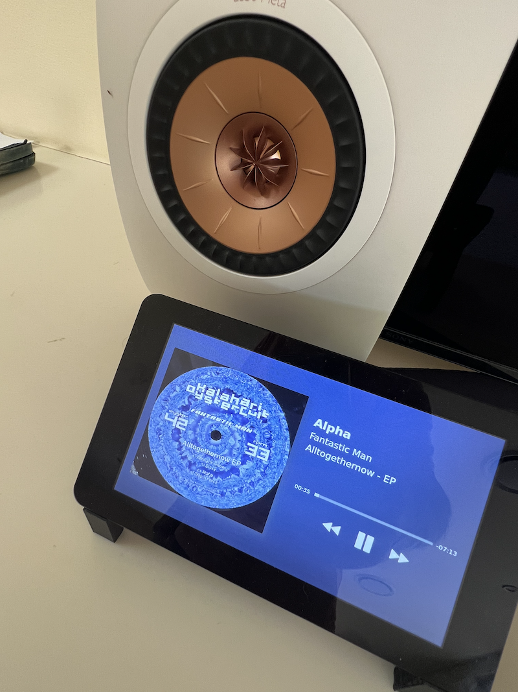

# shairport-display-qt

A simple app to be used with [shairport-sync](https://github.com/mikebrady/shairport-sync) with the pi 4b plus the official Raspberry Pi 7" 800 pixel touchscreen

Table of Contents
=================

  * [Background](#background)
  * [Changes](#my-setup)
  * [My Setup](#my-setup)
  * [Usage](#usage)
  * [TODO](#todo)
  * [DTB Patching](#dtb-patching)

## Background

A fork of lrusak/shairport-display-qt for current Pi 4B. Commments here are limited to the changes I made.

## Why use this

A UI that displays the current track for shairport-sync is an obvious need for a pi with a screen. lrusak/shairport-display-qt is a light weight equivalent to his original shairport-display as GTK is quite heavy for a raspberry pi (it requires the entire Gnome environment). PyQt is much easier to install: from a base Pi is just 'apt install python3-pyqt5'

## Changes

* Modification of QT Display to all black background by default.
* Addition of Previous / Play / Pause / Next buttons in Qt Display.
* Addition of auto-scrolling for the text fields that exceed length.
* Removal of the window title bar (it is, after all, full screen)
* Set screen cursor to BlankCursor (it is, after all, a touch screen)

## My Setup

Raspberry 4b with official Raspberry 4b 7" touch screen and a 3d printed black bezel/case/stand combo for the pi+7" screen from thingiverse.

## Usage

Same usage notes as lrusak/shairport-display-qt:master however with the following extra information: 
[code]
Change /etc/xdg/lxsession/LXDE-pi/autostart from @lxpanel etc, to be:

@python3 /full/path/to/shairport-display-qt.py
@xset -dpms
[/code]

## TODO

* Add note on the best way to flip the entire orientation of the screen to match preference for cables etc
* Add Volume control slider
* Add notes on how to integrate this with 2 or 3 desktops and guestures for swiping to 2 or 3 other full screen apps
* How best to remove the screen brightening / dimming options into a seperate process
* Notes on other full screen X pi apps that could co-exist (internet radio? weather?)

## DTB Patching

Unlike a pi 3 of 2018 there is no DTB patching required for the Raspberry pi 4b and 7" display
